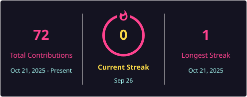

👋 Hi, I'm Tulasi Kumar

⚡ Electronics & Communication Engineering Student

Hardware | RF & Communication | Embedded Systems | Electronics

 Profile Views

  

## 👨‍💻 About Me

I'm a B.Tech Electronics & Communication Engineering student passionate about understanding how electronic systems work and turning concepts into practical projects.

🔹 Interested in hardware and RF systems
🔹 Exploring embedded systems and PCB design
🔹 Learning C, Python and MATLAB
🔹 Interested in VLSI and communication systems
🔹 Enjoy building and experimenting with engineering projects

---

## ⚙️ My Engineering Interests

 RF & Communication
        ↓
 Electronics & Hardware
        ↓
 Embedded Systems
        ↓
 PCB & VLSI
        ↓
 Practical Engineering Projects

---
## 📚 Currently Learning

Area| Focus
 Electronics| Analog & Digital Electronics
 Communication| RF & Communication Systems
 Programming| C & Python
 Simulation| MATLAB & Multisim
 Hardware| Embedded Systems
 Digital Design| VLSI
 Hardware Design| PCB Design

---

## 📊 GitHub Stats & Trophies

  

  

## 🔥 Contribution Streak

  

---

##  Languages & Tools

---

##  My Goal

> To build strong practical skills in electronics, hardware, RF systems and embedded technology, and develop real-world engineering solutions.
---

## 🤝 Let's Connect

 
⚡ Learn • Build • Experiment • Innovate

